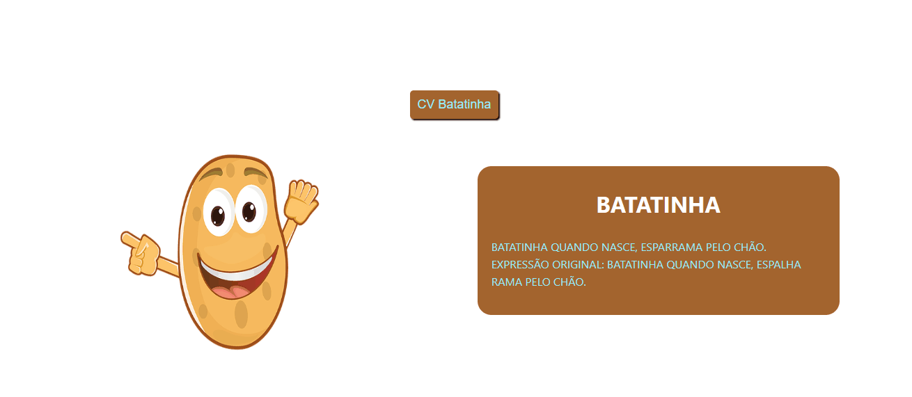

# Desafio Base React
Projeto realizadocom React para cumprir Desafio do Curso DevQuest.

O objetivo do projeto foi renderizar na tela um parágrafo colorido e com todas as letras maiúsculas usando JS por meio de components.

Foi utilizado props para passar o texto e a cor para dentro do component.

Criou-se também um componente Button com um evento de clique para mostrar uma mensagem.

## Tecnologias utilizadas
- React
- CSS
- Javascript

### Conceitos Aplicados de cada Tecnologia
<ol>
    <li>React
        <ul>
        <li>Create React App</li>
        <li>Uso de Components</li>
        <li>Uso de Props e props.children</li>
        <li>Utilização de Eventos</li>
        <li>Utilização de ArrowFunctions no React</li>
        </ul>
    </li>
    <li>CSS
        <ul>
        <li>Estruturação em Flex-Box</li>
        <li>Uso de Class</li>
        </ul>
    </li>
    <li>Javascript
        <ul>
        <li>Utilização de Interpolação de String </li>
        <li>Utilização do módulos ( import e export ) </li>
        </ul>
    </li>

</ol>

